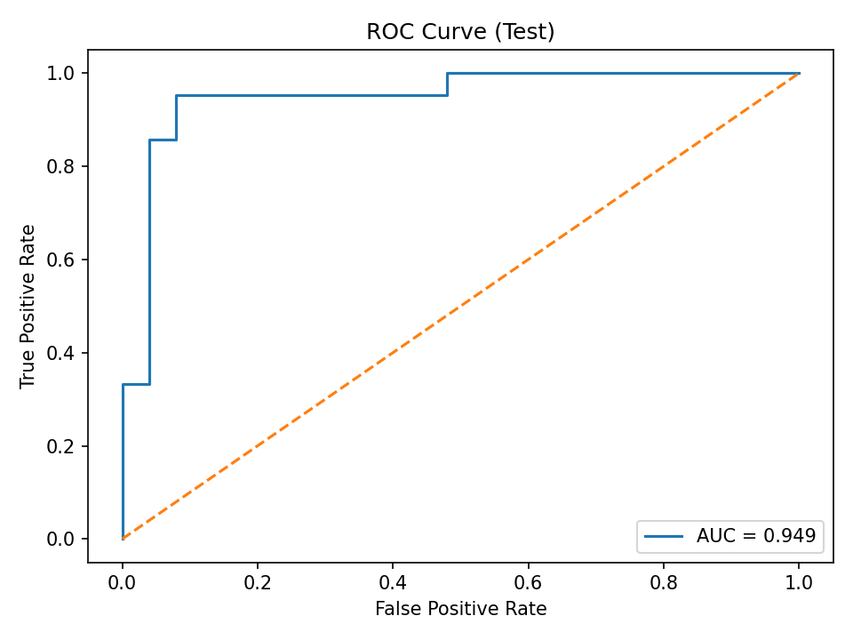
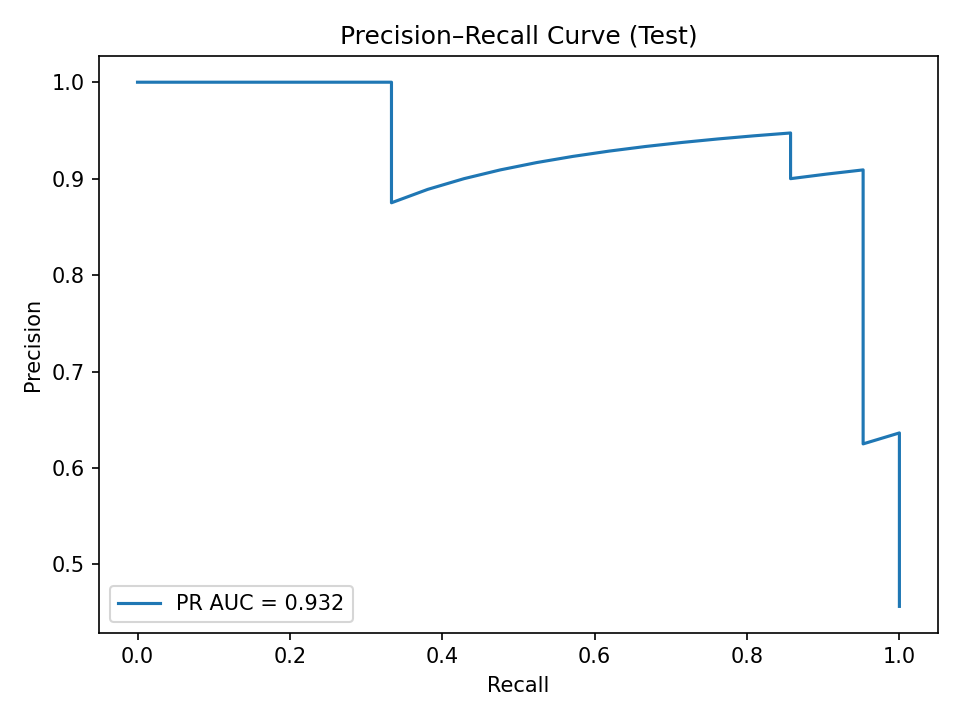
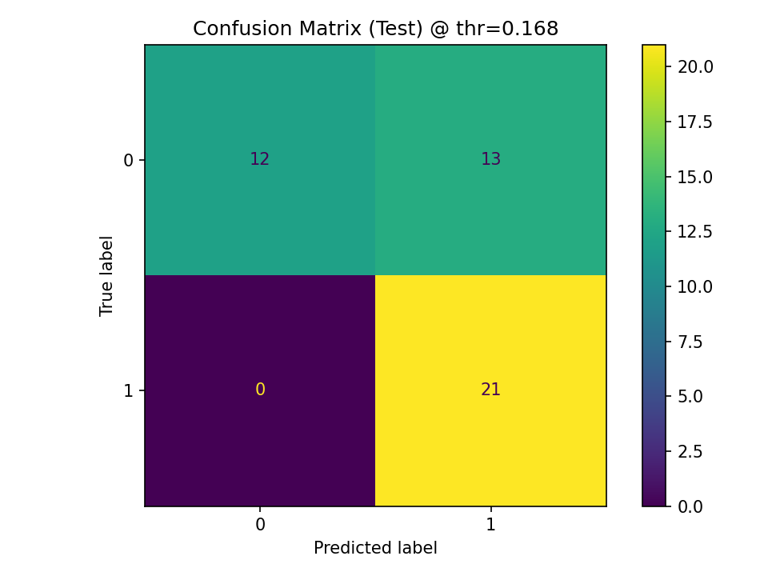

# UCI Heart Disease – ML Starter Project

โครงสร้างโปรเจกต์ Machine Learning แบบมาตรฐาน สำหรับการทำนายความเสี่ยงโรคหัวใจ  
โดยใช้ชุดข้อมูล **UCI Heart Disease (Cleveland)** และโค้ดโครงสร้างที่สามารถนำไปต่อยอดได้ทันที  
โปรเจกต์นี้ออกแบบเพื่อแสดงกระบวนการทำงานของ ML แบบ **end-to-end** ตั้งแต่โหลดข้อมูล → เตรียมข้อมูล → สร้างโมเดล → ประเมินผล → เก็บ artifacts

---

## 📌 วัตถุประสงค์ (Objective)
- พัฒนา pipeline ML ที่ reproducible และ maintainable
- ใช้ **ColumnTransformer** ในการแยกขั้นตอน preprocessing สำหรับข้อมูลเชิงตัวเลขและเชิงหมวดหมู่
- ประเมินโมเดลโดยเน้น **Recall** และ **ROC-AUC** เพื่อความสำคัญของการจับผู้ป่วยให้ครบ
- ทดลองการเลือก threshold เพื่อให้ผลลัพธ์สมดุลระหว่าง Recall และ Precision

---

## 📂 โครงสร้างโฟลเดอร์
ml-starter/
├── configs/
│ ├── data.yaml
│ └── train.yaml
├── data/
│ └── raw/
│ └── processed.cleveland.data
├── artifacts/
│ ├── model.joblib
│ └── metrics.json
├── src/
│ └── ml_starter/
│ ├── data/loader.py
│ ├── features/pipeline.py
│ └── models/train.py
├── tests/
│ ├── test_loader.py
│ ├── test_pipeline.py
│ └── test_train_integration.py
├── README.md
├── pyproject.toml
└── Makefile

---

## 📊 ข้อมูล (Dataset)
- แหล่งข้อมูล: [UCI Machine Learning Repository – Heart Disease](https://archive.ics.uci.edu/dataset/45/heart+disease)
- ข้อมูลจาก **Cleveland Clinic Foundation** เท่านั้น
- ฟีเจอร์ 13 ตัว เช่น อายุ (`age`), เพศ (`sex`), ความดันเลือด (`trestbps`), คอเลสเตอรอล (`chol`), อัตราการเต้นหัวใจสูงสุด (`thalach`) เป็นต้น
- Target: `num` แปลงเป็น `target` (1 = มีโรค, 0 = ไม่มีโรค)

---

## ⚙️ วิธีติดตั้งและรัน

### 1) Clone และติดตั้ง
```bash
git clone https://github.com/yourusername/ml-starter.git
cd ml-starter
python -m venv .venv
source .venv/bin/activate   # Windows: .venv\Scripts\Activate.ps1
pip install -e .
pre-commit install
---

### 2) เตรียมข้อมูล
ดาวน์โหลดไฟล์ processed.cleveland.data จาก UCI แล้ววางไว้ที่:
data/raw/processed.cleveland.data
---
### 3) ฝึกโมเดล
python -m ml_starter.models.train

ผลลัพธ์จะถูกเก็บที่:
artifacts/model.joblib
artifacts/metrics.json
---
### 4) ดูผลลัพธ์
cat artifacts/metrics.json
---

## 📈 ผลลัพธ์ (Baseline)
Threshold Method: F1-optimal (~0.168)
Test Set:

Recall: 1.00

Precision: 0.66

F1: 0.79

Specificity: 0.57

ROC-AUC: 0.95
---
## Plots



---
## 🛠️ Pipeline สรุป
1.Data Loading – อ่านไฟล์ CSV, จัดการ missing values, แปลง target

2.Preprocessing –

-Numeric: median impute + StandardScaler

-Categorical: most_frequent impute + OneHotEncoder

3.Model – Logistic Regression (L2 regularization)

4.Evaluation – Stratified train/val/test split, ROC-AUC, Recall, Precision, F1

5.Threshold Tuning – เลือก threshold แบบ F1-optimal จาก validation set

6.Artifacts – เซฟโมเดล + metrics


